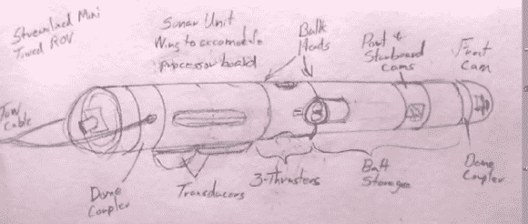

# 海底 0.19 里格

> 原文：<https://hackaday.com/2014/01/18/0-19-leagues-under-the-sea/>

[Doug]和[Kay]在过去几年里一直在建造一艘 70 英尺长的钢制帆船，由于俄克拉荷马州的家/商店外面太冷了，他们将他们的项目带到室内过冬。在天气稍微暖和一点之前，他们正在研究一种水下 ROV，能够潜水到 3000 英尺以下，在海底机动，并将视频和侧扫声纳发送回他们自制的船。

就像[道格]和[凯]在造船方面的冒险一样，他们通过 YouTube 视频记录了 ROV 建造的整个过程。[第一个视频](http://www.youtube.com/watch?v=nxUparCg_VU)讲述了用一大块内径 10 英寸、壁厚 0.5 英寸的钢管建造一个压力容器。ROV 的设计看起来有点像鱼雷，由船只牵引，摄像头指向各个方向。

[为了与地面通信](http://www.youtube.com/watch?v=7dBWowZWCp0),所有东西都通过一根 5 类电缆传输。他们使用以太网扩展器，该扩展器使用双绞线将以太网连接到海底。有了它，[几个 IP 网络摄像头将视频传送到船上](http://www.youtube.com/watch?v=25jhvh0BK0g)，一个简单的 Arduino 设置允许控制船上的推进器。

推进器？他们不再使用昂贵的定制解决方案，而是使用现成的遥控汽车和飞机的无刷电机。通过封装无刷外转子电机的线圈，【道格】和【凯】[发现这个解决方案非常有意义](http://www.youtube.com/watch?v=HMjzz5UgVXM)；它便宜，相当可靠，不需要大量的工程，最重要的是便宜。

下面的一堆视频，或者只是看看[道格]和[凯]在他们稍微过时的博客上的进展[。](http://www.svseeker.com/)

[https://www.youtube.com/embed/nxUparCg_VU?version=3&rel=1&showsearch=0&showinfo=1&iv_load_policy=1&fs=1&hl=en-US&autohide=2&wmode=transparent](https://www.youtube.com/embed/nxUparCg_VU?version=3&rel=1&showsearch=0&showinfo=1&iv_load_policy=1&fs=1&hl=en-US&autohide=2&wmode=transparent)

[https://www.youtube.com/embed/7dBWowZWCp0?version=3&rel=1&showsearch=0&showinfo=1&iv_load_policy=1&fs=1&hl=en-US&autohide=2&wmode=transparent](https://www.youtube.com/embed/7dBWowZWCp0?version=3&rel=1&showsearch=0&showinfo=1&iv_load_policy=1&fs=1&hl=en-US&autohide=2&wmode=transparent)

[https://www.youtube.com/embed/25jhvh0BK0g?version=3&rel=1&showsearch=0&showinfo=1&iv_load_policy=1&fs=1&hl=en-US&autohide=2&wmode=transparent](https://www.youtube.com/embed/25jhvh0BK0g?version=3&rel=1&showsearch=0&showinfo=1&iv_load_policy=1&fs=1&hl=en-US&autohide=2&wmode=transparent)

[https://www.youtube.com/embed/HMjzz5UgVXM?version=3&rel=1&showsearch=0&showinfo=1&iv_load_policy=1&fs=1&hl=en-US&autohide=2&wmode=transparent](https://www.youtube.com/embed/HMjzz5UgVXM?version=3&rel=1&showsearch=0&showinfo=1&iv_load_policy=1&fs=1&hl=en-US&autohide=2&wmode=transparent)