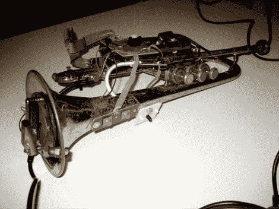

# 小号英雄

> 原文：<https://hackaday.com/2012/03/29/trumpet-hero/>

将一个旧短号和一个旧的 PS2 吉他英雄控制器结合起来，产生了小号英雄。看起来脆弱的团块真的给我们带来了笑容。在钻孔安装各种部件之前，请确保该仪器已经寿终正寝。

在上面的图像中，你可以看到三个阀门按钮被绘制成与原始吉他控制器上的品相对应。橙色和蓝色的品是为左手操作而放置的。似乎有几个不同的版本，因为有一个图表显示，在铃中有一个静音，可以扭曲为晦气条输入，但这里没有显示。扫弦是通过吹口来完成的，但正如你在休息后的视频中看到的，没有嗡嗡声是必要的。

使用真实的乐器作为游戏输入非常有趣。我们总是回想起[摇滚乐队](http://hackaday.com/2009/11/13/instruments-as-games-games-as-instruments/)的长笛和架子鼓控制器。