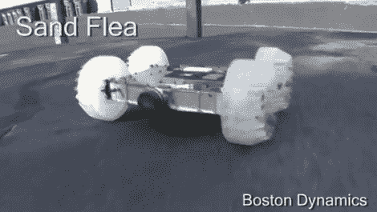

# 沙蚤一跳就能跳过高楼

> 原文：<https://hackaday.com/2012/03/31/sand-flea-literally-leaps-tall-buildings-in-a-single-bound/>

这个不比餐盘大的机器人隐藏的能力令人印象深刻。它不会让建筑物之类的障碍物挡住自己的路。沙蚤，就像它的名字一样，拥有惊人的跳跃能力。当它遇到一个高大的障碍物时，两个杠杆倾斜机器人的前部，它将自己发射到三十英尺高的空中。在单层建筑的情况下，这意味着它将在屋顶上结束，它将比我们见过的任何爬墙者[更快更可靠。](http://hackaday.com/2011/09/12/wall-climbing-bot-does-it-with-ease/)

它是由波士顿动力公司为美国陆军开发的，这不是我们第一次看到这个概念。但是插播之后的视频比去年的第 22 秒的粗糙视频看起来要好得多。当然，他们没有透露太多细节，所以我们只能猜测一点。我们打赌发射机构是一个螺线管，但在大约 11 磅的时候，你需要大量的能量来获得这么大的跳跃。我们认为也有可能有一个爆炸系统，像一个框架钉枪中使用的丁烷燃烧。视频摘要提到有一个稳定系统来保持身体在飞行中的方向。那一定是个陀螺仪。请在评论中告诉我们你的想法。

[https://www.youtube.com/embed/6b4ZZQkcNEo?version=3&rel=1&showsearch=0&showinfo=1&iv_load_policy=1&fs=1&hl=en-US&autohide=2&wmode=transparent](https://www.youtube.com/embed/6b4ZZQkcNEo?version=3&rel=1&showsearch=0&showinfo=1&iv_load_policy=1&fs=1&hl=en-US&autohide=2&wmode=transparent)

[谢谢贝塔莱特]