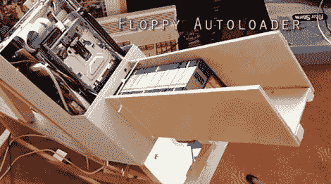

# 软驱自动加载器解决了存档 5000 张 Amiga 磁盘的难题

> 原文：<https://hackaday.com/2012/03/31/floppy-autoloader-takes-the-pain-out-of-archiving-5000-amiga-disks/>

从旧软盘存档数据可能是一个乏味的过程。标签不好的磁盘加上缓慢的传输速度使它成为我们不愿意做的事情中的一件，而[事实证明【居住者】也有同样的看法。](http://dwellertech.blogspot.com/2012/02/converting-all-my-amiga-disks.html)他的收藏中估计有 5000 张软盘，他最终决定是时候清理门户了。

由于不知道什么存储在哪里，他决定最好的方法是读取所有的磁盘，将所有内容归档，将排序过程留到以后。他最初是用乐高 Mindstorm 零件制作一个软盘自动加载器，在纸上看起来不错，但性能相当差。

他在易贝偶然发现了一台旧的软盘复制器，并认为既然这台机器是为处理大量磁盘而制造的，那它就是他的自动装弹机的完美底座。他从机器中取出机械零件，将它们整合到你上面看到的装置中。他把复印机的大脑换成了 Arduino，这让他可以批量复制他的磁盘，并毫不费力地保存每个标签的图片。

他说这个系统非常好用，让他的生活变得轻松多了(也不那么杂乱了！)

看看下面的视频，看看他的软盘自动加载器的行动。

【YouTube-= https://www . YouTube . com/watch？v=H5lkxSY7QsI&w=470]