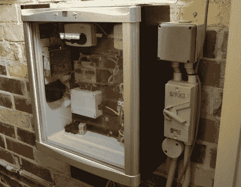

# 打造电梯控制器，赢得一生的朋友

> 原文：<https://hackaday.com/2012/04/01/build-an-elevator-controller-gain-a-friend-for-life/>

一天,[迈克尔·鲁普]正在工作，一个名叫[凯文]的人找到他，希望他能在一个项目上提供一点帮助。碰巧[Kevin]正在建造一部 DIY 住宅电梯，他需要人帮忙组装一块控制板。

[Kevin]在他的地下室楼板上安装叉车撞锤没有问题，在定制的液压坑中安装潜水泵也没有问题，但他不喜欢为设备的控制装置布线。[迈克尔]非常乐意伸出援手，在接下来的几个月里，这对搭档把事情做得很好。

[Michael]没有依赖微控制器，而是建造了一个控制板，只使用几个继电器和微型开关来完成工作——不难理解控制器的简单性。

正是这些故事提醒我们，黑客社区是多么愿意帮助完全陌生的人完成任何任务，无论任务大小——你们真棒！

留下来看一个简短的演示视频[迈克尔]拍摄，显示电梯的行动。

[vimeo http://vimeo.com/37793506 w=470]