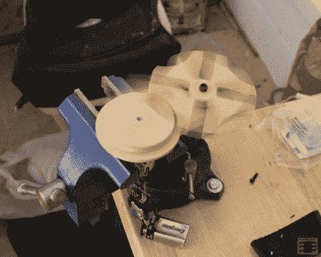

# 木制的日内瓦小车道

> 原文：<https://hackaday.com/2012/04/01/a-little-geneva-drive-made-of-wood/>

很久以前，在伺服电机和线性致动器普遍使用之前，工程师们使用智能机械设备来产生他们的过程所需的运动。 [CNC 切割的槽轮驱动](http://www.jcopro.net/2012/03/27/a-motorized-geneva-drive/ "CNC-cut MDF Geneva Drive")可能不适合工业使用，但是[这种类型的装置](http://en.wikipedia.org/wiki/Geneva_drive "Geneva drive Wikipedia article")已经被用于从电影放映机到旋转装配台的任何东西。驱动轮的持续旋转被[马耳他十字]从动轮转化为间歇运动。

除了电机轴压入其中的油灰材料之外，这种特殊驱动器的驱动器和马耳他横截面由 MDF 制成。文章声称这是现有的唯一一款由 MDF 制成的 Geneva drive，但是，我们希望看到评论中证明这是错误的！

如果你想自己做一个，CAD 和 g 代码文件会在另一篇文章中提供给手摇版本的[驱动。如果你不熟悉像这样的驱动器是如何工作的，或者只是想看看所有的动作，一定要在休息后看看它的视频！](http://www.jcopro.net/2012/03/04/a-cnc-cut-geneva-drive/ "hand-cranked MDF Geneva Drive")

[https://www.youtube.com/embed/32q9gowB7N0?version=3&rel=1&showsearch=0&showinfo=1&iv_load_policy=1&fs=1&hl=en-US&autohide=2&wmode=transparent](https://www.youtube.com/embed/32q9gowB7N0?version=3&rel=1&showsearch=0&showinfo=1&iv_load_policy=1&fs=1&hl=en-US&autohide=2&wmode=transparent)