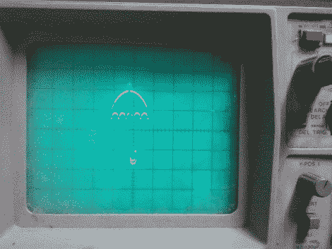

# rabiscoscopio–简化示波器绘图

> 原文：<https://hackaday.com/2012/04/03/rabiscoscopio-oscilloscope-drawing-made-easy/>

如果你有一台示波器，迟早会有在屏幕上看到信号以外的东西的冲动。一些人无视这种冲动，继续他们正常的工作，而另一些人屈服了，[花费数小时精心制作图像](http://hackaday.com/2012/03/06/3d-graphics-on-an-oscilloscope/)、游戏、[和更多的](http://hackaday.com/2012/01/12/oscilloscope-clock-made-possible-by-dumpster-diving/)。正如我们的凯文·戴迪(Kevin Dady)所发现的那样，这个过程既耗时又棘手[，但回报以极客信誉的形式出现，让人难以拒绝。](http://hackaday.com/2011/08/01/want-to-play-pong-on-your-oscilloscope/)

[Alex]想在示波器上画画，但决定尝试我们过去见过的基于微控制器的解决方案之外的解决方案。他认为在示波器上绘图最简单、最容易的方法是用声音，所以他迅速开发了一个名为 Rabiscoscopio 的小应用程序来替他完成大部分工作。

他首先用一条线绘制一幅图像，并将其保存为 SVG 文件。Rabiscoscopio 将该图像转换成音频文件，然后可以从他的 PC 直接输入到他的示波器中。事情就是这样，真的不会变得更容易。

虽然你可以声称[亚历克斯]在示波器绘图过程中作弊，但我们认为他的应用程序很棒——毕竟，黑客是为了让你的技术为你服务，而不是相反。

给 Rabiscoscopio 一个机会，把结果贴在这里或者我们的 Flickr 流中，我们很乐意看到你们的成果。

同时，看看下面的视频，看看[Alex]试图在他的瞄准镜上复制 [Garoa Hackerspace 标志](http://www.garoa.net.br/)。

[https://www.youtube.com/embed/46jEW5pYeHk?version=3&rel=1&showsearch=0&showinfo=1&iv_load_policy=1&fs=1&hl=en-US&autohide=2&wmode=transparent](https://www.youtube.com/embed/46jEW5pYeHk?version=3&rel=1&showsearch=0&showinfo=1&iv_load_policy=1&fs=1&hl=en-US&autohide=2&wmode=transparent)