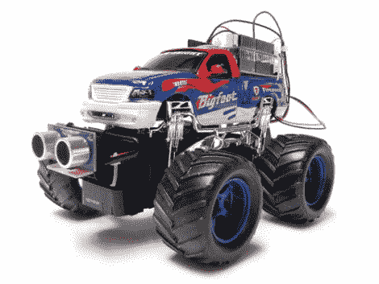

# 用这个简单的大脑交换让你的遥控汽车自动驾驶

> 原文：<https://hackaday.com/2012/04/04/make-your-rc-car-drive-itself-with-this-simple-brain-swap/>

如果孩子们对你在假期给他们买的遥控汽车或卡车失去了兴趣，Instructables 的 Randy Sarafan 有一些想法可以让这些玩具再次变得有趣，同时在这个过程中教你的孩子一些电子知识。在他的文章中，他展示了如何替换掉你运行的钢筋混凝土卡车的大脑，使它能够做远超过最初预期的事情。这个过程非常简单，如果你愿意，你可以很容易地让你的孩子参与进来。

他使用一个 Arduino 和一个电机屏蔽来保持转换简单，但这可以用手头上任何有能力的微控制器来完成。[Randy]在卡车前部添加了一个视差传感器，使其能够在自动驾驶时避开物体，但由于他切除了卡车的原始控制板，我们假设目前没有办法超越卡车的行动。

[Randy]称这种转换为“机器人”,但如果你问我们，它看起来更像是一种半自动漫游车。不管怎样，改造一辆旧的遥控汽车肯定比让它在架子上积灰好得多，或者更糟，在春季大扫除时扔掉它。

继续阅读，观看一段[Randy 的] RC 卡车的视频短片。

[via [HackedGadgets](http://hackedgadgets.com/2012/04/02/rc-car-brains-swapped-with-an-arduino/)

[https://www.youtube.com/embed/Wn3Le37qW64?version=3&rel=1&showsearch=0&showinfo=1&iv_load_policy=1&fs=1&hl=en-US&autohide=2&wmode=transparent](https://www.youtube.com/embed/Wn3Le37qW64?version=3&rel=1&showsearch=0&showinfo=1&iv_load_policy=1&fs=1&hl=en-US&autohide=2&wmode=transparent)