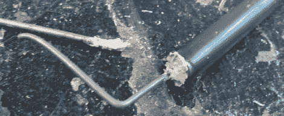

# 为 DIY 烧烤吸烟者定制加热器

> 原文：<https://hackaday.com/2012/04/04/custom-heaters-for-a-diy-bbq-smoker/>

空气中弥漫着春天的气息，随之而来的是经过几十个小时烹制的美味佳肴。在准备你每年的猪肉和牛肉配额时，看看[Brett Beauregard]为 DIY 木材吸烟者制作的定制加热器元件。

这是继去年非常成功的吸烟者【布雷特】之后建造的。今年，他使用了同样的烤面包机加热元件，只是减少了加热元件以使加热器更小更有效。基本上，[布雷特]正在用他现有的设备制造一个小型筒式加热器。

在将烤面包机的加热元件切割成一定长度后，[布雷特]铰去末端，露出镍铬合金线。用 TIG 焊机短时间的焊接将导线焊接到加热元件上。用炉灰绝缘，[布雷特]有一个定制的加热器，非常适合烧焦大块的豆科灌木或山核桃树。

肉食者并不复杂——他们可以用一个[花盆和一个电炉](http://www.youtube.com/watch?v=_Ka2kpzTAL8)建造，并且仍然可以做一顿美味的晚餐。当我们制作今年的 smoker 时，我们可能不得不借用[Brett]的技术。