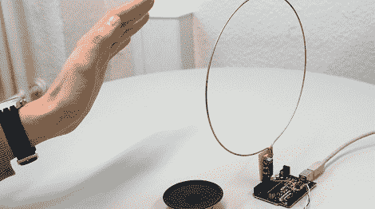

# 快速简单的 Arduino 动力特雷门琴

> 原文：<https://hackaday.com/2012/04/05/quick-and-easy-arduino-powered-theremin/>

[Martin]向基于 theremin 的简单 Arduino 发送了一个[优秀指南](http://interface.khm.de/index.php/lab/experiments/theremin-as-a-capacitive-sensing-device/)。这是一个非常小的构建——只有一个普通 IC 和一些无源元件——在一个下午就可以轻松构建。

特雷门振荡器基于一个简单的 LC 振荡器，该振荡器围绕一个 7400 四路与非门 IC、一个线状天线以及几个电容和电阻构建。当手移近天线时，振荡器的频率增加；当手移开时，频率降低。在软件方面，振荡器连接到 Arduino 的内部硬件计数器。振荡器输出的电压每有一次变化(总是随着手到天线的距离而轻微变化)，计数器就增加 1。该计数器在 1/10 秒的时间内计数，可以确定从乐器演奏者到特雷门琴的距离。从那里，它只是输出一个频率到一个扬声器。

所有代码、原理图和电路板布局都可以在[Martin]的指南中找到，我们的大多数读者可能在他们的工作台上就有构建它的零件。你可以在他的指南中查看[马丁]的特雷门琴使用视频。