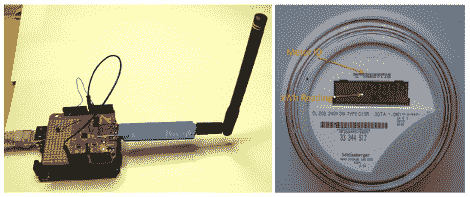

# 收集和绘制无线家用电表信息

> 原文：<https://hackaday.com/2012/04/09/harvesting-and-graphing-wireless-household-utility-meter-info/>

我们的电表和煤气表都在房子的地下室里(不过我们最近把煤气表搬到了外面)。当人们看到这种情况时，他们总是问抄表员是否必须每月来一次。答案是否定的，当公共事业公司的车辆在街上行驶时，这些仪表会广播每月采集一次的使用数据。如果你家里有无线电表，这里有一种收集和绘制无线数据的方法，这样你就可以分析你的使用模式。

这里使用的硬件是一种特殊的 USB 加密狗。它有一个 900 MHz 的无线电，可以从一个相当大的电表类型列表中挑选出数据包，并通过 USB 接口发送出去。在上图中，你可以看到使用了一个带 USB 主机保护的 Arduino，但是如果你想把它直接连接到你的电脑上，也有一些驱动程序。

我们环顾四周，没有发现任何关于该板所用硬件的细节。但是在家里制作一个也不是很难…组装板似乎只有两个 IC 和几个无源元件。有人能挑战组装自己的数据包嗅探器吗？我们[想知道下一个希望徽章](http://hackaday.com/2011/10/08/rf-sniffing-on-the-go/)能否拉下数据？

[谢谢克里斯]