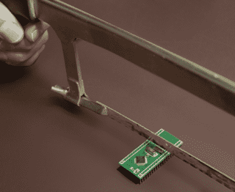

# 可调整大小的 ARM 开发板；从上面拿掉一些

> 原文：<https://hackaday.com/2012/04/09/resizable-arm-dev-board-just-take-some-off-the-top/>

[鲍勃·亚历山大]最近的项目是[一个可调整大小的臂分线板](http://www.galacticstudios.org/blackknight/)。他希望在他的项目中开始使用更多的 ARM 微控制器，并寻求一种试验板友好设计。它采用 40 引脚 dip 封装，但如果你需要的是马力而不是 I/O，你可以把它缩小。我们可能会建议拿一些锡剪，它们可以像切黄油一样切开 PCB，但要因人而异。

该板基于 STM32 芯片。你会发现一个系统时钟的晶体振荡器，如果你需要的话，还有一个时钟晶体。在芯片的另一面，他包括了一个电压调节器。这种设置提供了显著的输入电压范围，在没有调节器的情况下可接受 2 至 3.6 伏的电压，如果有调节器，则可接受高达 16 伏的电压。他设计了一种封装，如果没有 SMD 器件，这种封装很容易桥接。如果你用的是底部有导体的垫子，就要确保垫子绝缘。他在文章中详细解释了这一点。

你需要一个程序员来操作电路板。为此，他使用了 STM32 发现板,但也有很多其他选择。