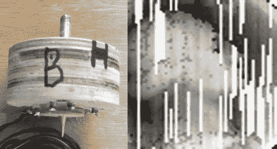

# 木制数控触摸探针

> 原文：<https://hackaday.com/2012/04/10/wooden-cnc-touch-probe/>

[Gary]通过 Flickr 向我们发送了一些他最新项目的照片，我们认为你们中的一些 CNC 所有者可能会感兴趣。他最近一直在用他的数控机床工作，并决定是时候为他的钻机制造一个接触式探针了。

他最初的目标是使用触摸探头来确保他的 CNC 工作台完全水平，但我们认为这将有助于未来许多不同的项目。[Gary]说他真的很想组装一个概念验证设备，但事情进展得太顺利了，他不得不分享一下。

他的探测似乎非常有效，即使没有我们过去见过的其他人的配合和完成。探头本身的主体由几层四分之一英寸厚的胶合板制成，装有三组两个螺钉。螺钉用金属丝连接在一起，以便在插入黄铜探针时形成闭合电路。当探头接触到固体物体时，电路断开，记录下探头头部的坐标。

虽然[加里]承认他在建造探测器时不够小心，但我们认为结果不言自明。对于第一次迭代，它的扫描能力相当令人印象深刻——我们迫不及待地想看到第二版。