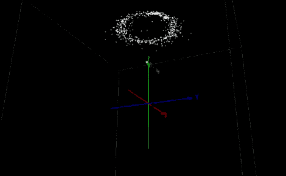

# Arduino 的高级指南针/加速度计库

> 原文：<https://hackaday.com/2012/04/10/advanced-compassaccelerometer-library-for-arduino/>

我们没有太多关于 DOF 硬件的个人经验，但这个 Arduino 库[读取并补偿三轴磁力计和加速计数据](http://n0m1.com/2012/02/27/6dof-arduino-compass-accelerometer/)看起来非常令人印象深刻。它应该适用于现有的硬件，但也有一个使用 Honeywell HMC5883L 指南针和 Freescale MMA8453Q 加速度计的演示设计，您可以自己制作。不幸的是，这些都是 QFN 封装的(像现在大多数便宜的加速度计一样)，所以你可能需要[在焊接](http://hackaday.com/2011/07/28/smd-soldering-with-gas/)时发挥创意。

这个图书馆有什么特别的？休息后观看视频(全屏使用 720p 以获得完整效果)，您将看到输出数据的三个不同散点图。上图是第三个例子的截图，它使用了硬铁偏移和加速度计补偿。也就是说，电路板上及其周围的金属以及器件的物理方向都要考虑在内。即使你以前没有使用这种硬件的经验，也很容易看出这种软件补偿的用处。

[https://www.youtube.com/embed/NF1ezexJuHk?version=3&rel=1&showsearch=0&showinfo=1&iv_load_policy=1&fs=1&hl=en-US&autohide=2&wmode=transparent](https://www.youtube.com/embed/NF1ezexJuHk?version=3&rel=1&showsearch=0&showinfo=1&iv_load_policy=1&fs=1&hl=en-US&autohide=2&wmode=transparent)