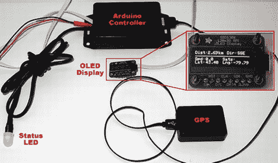

# 使用全球定位系统来留意闯红灯的摄像头

> 原文：<https://hackaday.com/2012/04/12/using-gps-to-stay-aware-of-red-light-cameras/>

取决于你如何看待它们，闯红灯摄像头是让人们小心驾驶的好方法，或者是一个十足的麻烦。我们同意后一种观点，就像[Dave]一样，[所以他造了一个方便的小装置](http://www.plastibots.com/?p=2392)，当他要接近其中一个十字路口时，它会提醒他。

他的红灯摄像头警报器是基于一个 Atmega 328P，带有 Arduino 引导程序。[戴夫]开车时，微处理器获取 GPS 坐标，将他的当前位置与该地区所有已知红灯路口的表格进行比较。当他靠近红灯摄像头时，状态 LED 会随着他的靠近而从蓝色变为黄色，再变为红色，从而很容易了解他的情况。他还在他的设备中安装了一个阿达果有机发光二极管显示器，可以实时显示他的速度、GPS 坐标、航向和距离红灯的实际距离。

虽然[戴夫]承认他并不真的需要警报器，因为只有几个警报器就在他附近，但他说这是一种有趣而简单的方式，可以获得一些在他的项目中使用 GPS 传感器的经验。他没有任何实际操作的视频，但你可以在他的博客上找到他用来驱动警报器的代码。