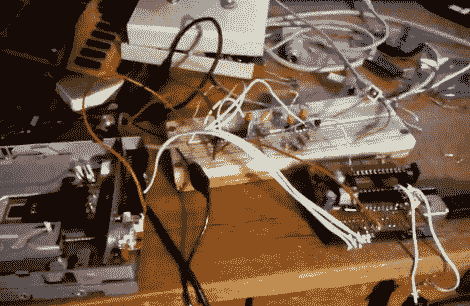

# 软盘驱动器作为音频采样器

> 原文：<https://hackaday.com/2012/04/12/floppy-drive-as-an-audio-sampler/>

这里有一个软驱被用作音频采样器。乍一看，我们认为这是另一种以特定频率驱动步进电机的产品，以使[以目标音高产生特有的声音](http://hackaday.com/2011/12/01/making-sweet-floppy-drive-music-with-a-calculator/)。但事实完全不是这样。软盘实际上被用作存储设备(如图)。

据我们所知，它几乎像 8 轨磁带一样被使用。一个 PWM 信号存储在磁盘的一个圆形片上，然后磁头可以移回到同一个“轨道”来播放波形。在回放过程中，磁头不会移动，只是一直读取相同的位轨道。在右边，你可以看到一个 Arduino 板。这允许 MIDI 控制轨道选择。[Alexis]在休息后展示了视频中的一些键盘控制。在试验板上有一个缓冲芯片，当软驱磁头移动时，可以快速关闭音频输出。这样可以在新音轨被读取之前，保持声音中没有垃圾。

[https://www.youtube.com/embed/fKAjncO5GQw?version=3&rel=1&showsearch=0&showinfo=1&iv_load_policy=1&fs=1&hl=en-US&autohide=2&wmode=transparent](https://www.youtube.com/embed/fKAjncO5GQw?version=3&rel=1&showsearch=0&showinfo=1&iv_load_policy=1&fs=1&hl=en-US&autohide=2&wmode=transparent)