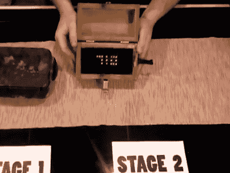

# 地理藏宝拼图上的红外隐藏密码组合

> 原文：<https://hackaday.com/2012/04/12/infrared-hides-code-combination-on-geocache-puzzle/>

[AJ]和[Brian]正在确保他们设置的 geocache 挑战需要一些独创性才能解决。他们刚刚推出了由两部分组成的缓存，使用隐藏在红外光中的代码。(来自遥远未来的编者按:链接 wend dead。[看看时光倒流机](https://web.archive.org/web/20131125114447/http://www.suburbiahell.com/2012/04/10/ajs-invisible-led-geocache/)。)

缓存的第一部分是一个盒子(左边的黑色盒子)，里面有一个神秘的手摇曲柄和一个上面有密码锁的小盒子。第二阶段是右边的木箱。它的侧面有一个孔，用来装手摇曲柄。这连接到内部的发电机，让你在它旋转时积累一些电力。在盒子里面，你会看到两个红灯随着曲柄的转动而闪烁，但是当你按下盒子外面的按钮时，什么也不会发生。也就是说，除非你是通过一个能捕捉红外光的相机来看。该代码(在这种情况下为 710)显示在红外发光二极管阵列中，用于打开该密码锁。我们想知道是否有任何关于使用相机的线索，或者你是否必须自己解决这个问题。

休息之后，请不要错过该系统的完整演示视频。

[http://www.youtube.com/watch?v=aNIHNy-bjG0](http://www.youtube.com/watch?v=aNIHNy-bjG0)