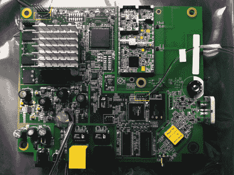

# 在美国电话电报公司的微蜂窝里摆弄毫微微蜂窝基站的硬件

> 原文：<https://hackaday.com/2012/04/12/poking-at-the-femtocell-hardware-in-an-att-microcell/>

这是一张美国电话电报公司微蜂窝内部的照片。这种硬件通过充当其自己的蜂窝塔并经由宽带连接连接到网络来扩展蜂窝网络。所以，如果你家里没有信号，你可以买一个，把它接到你的电缆调制解调器或 DSL 上，噗，你的手机又能用了。[C1de0x]决定[破解一个，看看里面藏着什么秘密](http://fail0verflow.com/blog/2012/microcell-fail.html)。

板上有两个系统芯片、一个 FPGA、无线电芯片和一个 GPS 模块。[C1de0x]使用了一些篡改检测电路，但是他将这些信息保存在以后的文章中。在拨弄硬件的过程中，他发现了 UART 连接，这让他可以接入每一个在启动时转储数据的 SOC。它使用 BusyBox 运行 Linux 内核，并且有 SSH 和 ROOT 帐户共享相同的密码。大约五天的自动破解和密码被发现。

但是当他偶然发现一个他称之为“巫师”的东西时，事情真的开始变得有趣了。这是一个后门程序，允许完全访问设备。现在看来，开发人员肯定遗漏了一些东西，因为它就在广域网上等着有人来摆弄它。响应被发送到一个硬编码的 IP 地址，但是对 iptables 做一点工作就可以解决这个问题。想知道这个安全缺陷会造成什么样的危害吗？看看[沃达丰毫微微蜂窝黑客](http://hackaday.com/2011/07/14/vodafone-femtocells-hacked-root-password-revealed/)就知道了。