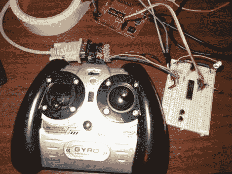

# 红外直升机控制器入侵了一个 Linux 游戏手柄

> 原文：<https://hackaday.com/2012/04/14/ir-helicopter-controller-hacked-into-a-linux-game-pad/>

[迈克·科恩的]司马 S107 直升机由于齿轮坏了，飞行不如以前好了，他想[他也可以为玩具的控制器](http://www.mikekohn.net/micro/syma_s107_linux_joystick.php)找到一些用处，因为它现在正坐在那里收集灰尘。今年早些时候，他在 T2 用 Syma IR 协议做了一堆工作，他决定让这个遥控器作为他的 Linux 桌面的游戏手柄非常容易。

他在 MSP430 板上安装了一个红外接收器，该接收器对输入的红外信号进行解码，并通过串行连接将其发送到他的电脑上。[Mike]在 Linux 源代码中寻找一些好的游戏杆驱动程序代码来借用，并找到了一些足够好用的东西。经过一点调整后，他加载了他的驱动模块，并启动 Mame 给(Pacman 女士)一个尝试。

他说，控制器工作起来没有太多麻烦，尽管正如他在以前的项目中发现的那样，控制器中有一些怪癖，使得它在全职使用时不太方便。如果你有兴趣看看他用来让事情运行的代码，可以去看看他的网站。