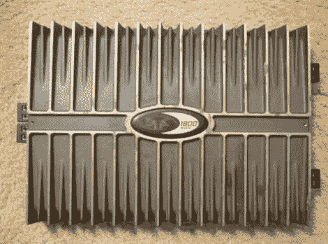

# 用少量零件将 Rockford Fosgate Punch 601s 升级为 801s

> 原文：<https://hackaday.com/2012/04/16/upgrading-a-rockford-fosgate-punch-601s-to-an-801s-with-just-a-handful-of-parts/>

[Simon]在他的车里有一个 Rockford Fosgate Punch 601s 放大器，虽然这是一个很棒的设备，但他希望他的立体声系统有更多的功率。事实证明，只需几个零件和一点焊接工作，[他就能够将放大器的输出功率提高 200 瓦](http://www.youtube.com/watch?v=XzRt6ecvzIo)，使其与 Punch 801s 不相上下。

每个放大器中的主板布局完全相同，使得转换过程相对容易。需要添加一些 MOSFETs，以及一些电阻和电容。大部分工作可以用一个像样的烙铁完成，尽管你可能需要一个热空气回流站来处理较小的电阻——这完全取决于你的技能。

我们真的不确定两个放大器之间的价格差异有多大，但我们非常确定转换是值得的。[Simon] [在他的网站](http://www.nichropulse.com/index.php?page=shop.product_details&flypage=flypage.tpl&product_id=52&category_id=8&option=com_virtuemart&Itemid=141)上以不到 60 美元的价格出售转换套件，但是如果你四处寻找的话，你可能会找到更便宜的零件。