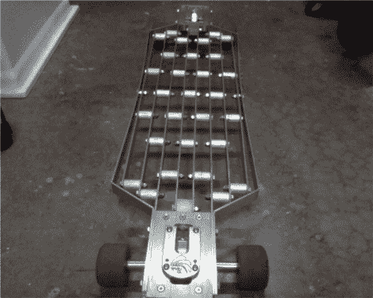

# 全铝长板尽显气概

> 原文：<https://hackaday.com/2012/04/17/all-aluminum-longboard-shows-its-mettle/>

Reddit 用户[davvik]制作了一个相册来展示他定制的[全铝长板](http://imgur.com/a/AG5h0#0)。整个装置重约 12 磅，对于主板来说并不算轻。尽管增加了重量，[davvik]评论说，它实际上是相当敏感的。设计是[并不罕见](http://cindrichboards.com/Photos.html#18)，但似乎已经选择了有利于结构刚性的速度孔，坦率地说，我们喜欢它。

我们可能不会冒险穿凉鞋，但[davvik]说，在很大程度上，整个装置有一种木制长板的感觉，增加的重量使下坡变得有趣。该板的未来计划包括加工出末端，我们认为这将是一些 DIY [阳极氧化](http://hackaday.com/2011/10/17/anodizing-and-dying-aluminum-without-battery-acid/)的好机会！

[via [Reddit](http://www.reddit.com/r/somethingimade/comments/sb6ce/a_longboard_out_of_aluminum/)