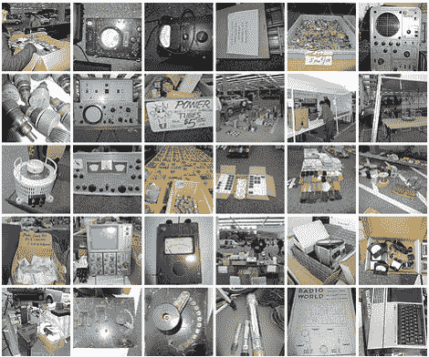

# 跳蚤市场发现

> 原文：<https://hackaday.com/2012/04/16/flea-market-finds/>

我们有时会想，为什么在二手商店看不到经典的电子设备。我们曾认为这是因为这些商品往往很快就会被抢购一空，但也许我们没有在正确的地方购物。这里有一组照片记录了最近在跳蚤市场的一些发现。

这些产品涵盖了广泛的产品和组件。有各种各样的工作台工具，如示波器、电压表和工作台用品。但是我们也看到更多的现代计算机部件，如装满主板的纸箱，以及成堆的 PC 电源总线。一美元可以买到五个管子插座，如果你需要管子，每个只要 3-5 美元。更有用的发现之一是一个陈列柜，里面装满了各种直径的收缩管；一个卖主正在按英尺出售电线。

车牌和常识把这个跳蚤市场定位在硅谷地区。但是如果你有更多关于这类事件的具体信息，请在评论区分享。

[途径 [Adafruit](http://www.adafruit.com/blog/2012/04/15/electronics-flea-market-04-14-2012/)