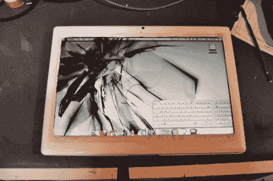

# 留言簿；被彻底黑掉的 Macbook 变身平板电脑

> 原文：<https://hackaday.com/2012/04/16/the-messagepad-a-thoroughly-hacked-macbook-turned-tablet/>

还记得 iPad 存在之前的时代吗？平板电脑实际上是一台平板外形的完整计算机。是的，那些日子我们都对平板电脑的未来非常乐观。不要以为我们不欣赏新的令人惊叹的玩具，我们身边有太多的平板电脑可供选择，但我们仍然梦想着全功能的平板电脑。

[Brian]来信向我们展示了他制作的功能齐全的平板电脑 macbook 转换版,名为 MessagePad。虽然[我们之前已经看到了各种各样的家用平板电脑](http://hackaday.com/2008/07/14/mac-tablets-made-by-fans/)，但这款平板电脑有一系列令人印象深刻的附加功能。它拥有前置和后置摄像头，一个固态硬盘，一个内置的 Teensy 和一个线路。不管你是否相信平板电脑的梦想，也不管你的偏好是 Windows 还是 Linux。你一定会喜欢他在这个东西上砍砍砍的过程中拍摄的一组照片。