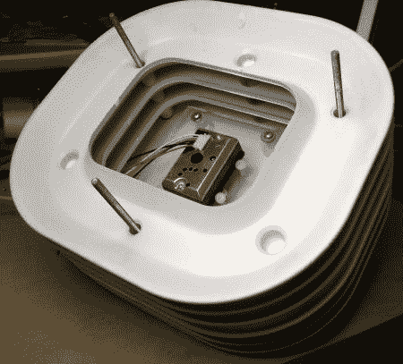

# 用 12 美元的传感器监测空气质量

> 原文：<https://hackaday.com/2012/04/19/monitoring-air-quality-with-a-12-sensor/>

[克里斯]有过敏症，哮喘，用的是烧木头的炉子。你可以想象为什么测试他的空气质量会是他感兴趣的事情。他有一个非常好的价值 290 美元的激光粒子计数器，但他真的很好奇他发现的价值 12 美元的夏普传感器将如何叠加。为了找到答案，[他将它插入 arduino，并开始在 pachube](http://www.howmuchsnow.com/arduino/airquality/) 上记录两者。

经过几次不同的测试，比如点燃一根火柴，吹灭它，让烟流入传感器，他决定他需要更好的东西。做些煎饼成了他的终极方法。在烹饪了一批美味的烤饼后，他绘制了颗粒消散的图表，发现这两个传感器惊人地相似。