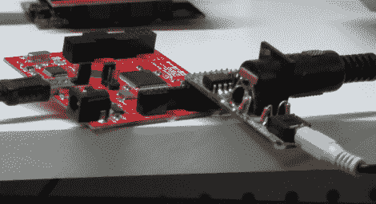

# 在 FPGA 内部构建 Arduino Chiptunes 项目

> 原文：<https://hackaday.com/2012/04/20/building-an-arduino-chiptunes-project-inside-an-fpga/>

我们时不时会发现自己有心情听一些小曲子。你知道，伴随所有最好的 8 位游戏机游戏的音乐？现在有很多项目使用以前的音频芯片来重现声音，但你总是面临着采购这些部件的问题。[杰克·加塞特]从其中一个项目中获得了一些灵感，但通过在 FPGA 中构建自己的 Chiptunes MIDI 设备[解决了罕见的硬件困境。](http://audio.gadgetfactory.net/index.php?n=Main.YM2149MIDISynthesizer)

他在 Arduino 控制的 YM2149 可编程声音发生器上看到了我们的一项功能。他意识到，你已经可以在那里找到模拟这种声音生成硬件的 FPGA 库，他已经用 Arduino 软处理器做了大量的[工作。为什么不把两者结合起来呢？](http://hackaday.com/2010/04/08/arduino-implemented-on-an-fpga/)

他使用的是带有翅膀的 Papilio FPGA，翅膀包括 MIDI 连接器和音频输出插孔。正如你在广告之后的片段中听到的，这听起来就像真的一样。他还计划将尽可能多的不同类型的声音发生芯片融入其中。你知道，一个 FPGA 合成器就能控制所有这些。

[http://www.youtube.com/watch?v=sbCybapnKTw](http://www.youtube.com/watch?v=sbCybapnKTw)