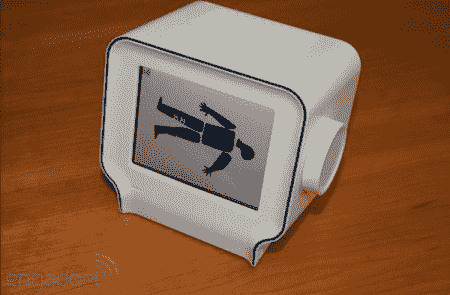

# Chumby 不再卖硬件了

> 原文：<https://hackaday.com/2012/04/21/chumby-is-no-longer-selling-hardware/>

听说 Chumby 将不再销售硬件让我们有点难过。我们已经看到这个东西被用于许多不同的事情，像[用导弹射击人](http://hackaday.com/2010/01/05/missile-hack-taunts-your-cat/)、[吐出合成视频](http://hackaday.com/2009/12/29/composite-video-output-from-chumby/)、[网络服务](http://hackaday.com/2010/11/29/chumby-webserver-using-upgraded-internal-storage/)、[跺着双脚](http://hackaday.com/2010/10/13/chumby-takes-its-first-steps/)，以及[作为 3g 路由器](http://hackaday.com/2010/04/29/chumby-one-becomes-a-3g-router/)。我们知道这不会很久，因为他们实际上已经在去年停止生产了，但是当官方宣布的时候，我们不禁感到热泪盈眶。让我们大家默哀片刻。