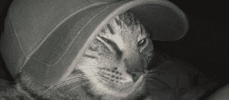

# Visible Kitteh 项目让老鼠远离家门

> 原文：<https://hackaday.com/2012/04/21/visible-kitteh-project-keeps-mice-out-of-the-house/>

[Aaron]和他的妻子有一只很棒的猫，它喜欢把田鼠、鼩鼱和田鼠带回家作为“礼物”，为家庭做出贡献显然，这导致血液、皮毛和内脏弄脏地毯，追逐受致命伤的啮齿动物不是[亚伦]的乐趣。为了阻止猫把小哺乳动物带进房子，[Aaron]现在正在[阻止猫在它嘴里有动物的时候进入房子](https://sites.google.com/a/forstersfreehold.com/visible-kitteh-project/)。

[Aaron]的项目灵感来自于[这种面部识别猫门](http://hackaday.com/2010/05/14/cat-door-unlocks-via-facial-recognition/)，它拒绝所有嘴里含着小啮齿动物的猫进入。为了让他的系统工作起来，【亚伦】[开始研究物体识别](https://sites.google.com/a/forstersfreehold.com/visible-kitteh-project/home/announcements/tutorial1objectrecognitionwithopencvandandroid-overviewofobjectrecognition)和[使用 OpenCV 库构建了一个安卓应用](https://sites.google.com/a/forstersfreehold.com/visible-kitteh-project/home/announcements/tutorial1objectrecognitionwithopencvandandroid-overviewofobjectrecognition)。为了检测他的猫嘴里是否有啮齿动物，[Aaron]正在使用 Harr cascades 一种经过验证的物体检测系统，可以检测并区分猫和猫加老鼠。

现在，这个项目只完成了一半。[Aaron]目前正在训练他的物体识别系统，这个过程可能需要几天时间。不过，在我们看来，任何能让老鼠的内脏远离地毯的东西都是一个了不起的项目。