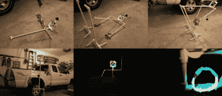

# 停止运动动画创建

> 原文：<https://hackaday.com/2012/04/23/stop-motion-animation-creation/>

我对定格动画一直很感兴趣，因为我“发现”人们可以通过将每一帧画得稍有不同来制作动画翻页书。快进 20 年左右，计算机技术已经发展到这样一个地步，这种事情可以很容易地以电子方式完成，而且价格低得令人难以置信，只需一台相机、计算机和免费或付费软件(这里是使用 GIMP 的[技术，GIMP](http://www.jcopro.net/2010/12/11/using-gimp-to-make-gif-animated-project-illustrations/ "Use GIMP to make animated .gifs")是一种免费的高质量照片编辑工具)就可以把所有东西放在一起。

上图的帧是我最新的[【PVC 人】动画](http://www.jcopro.net/2012/03/20/birth-of-a-pvc-man-full-video-and-how-this-stop-motion-animation-was-made/ "PVC Man animation with GIMP")，可以用一些电致发光灯，手套，和一些 PVC 管做出来。每一帧都是单独拍摄的，经过几个小时的工作，我们已经有了足够 17 秒的定格动画。

虽然谈不上完美，但这些动画的质量已经从我用一部旧的 ENV2 照相手机制作的第一部动画《T2》大幅提升。虽然我用的是[【定制坐骑】](http://www.jcopro.net/2011/01/24/env2-camera-phone-tripod-mount/ "Env2 Tripod mount")，但这些出来的效果真的很棒。就像所有与黑客相关的事情一样，这个过程是一个持续的过程。休息之后，请观看[PVC man]视频以及一部早期 ENV2 制作的定格短片！

 [https://www.youtube.com/embed/xZl-FnY58n4?version=3&rel=1&showsearch=0&showinfo=1&iv_load_policy=1&fs=1&hl=en-US&autohide=2&wmode=transparent](https://www.youtube.com/embed/xZl-FnY58n4?version=3&rel=1&showsearch=0&showinfo=1&iv_load_policy=1&fs=1&hl=en-US&autohide=2&wmode=transparent)

[https://www.youtube.com/embed/InM0MKDiOVU?version=3&rel=1&showsearch=0&showinfo=1&iv_load_policy=1&fs=1&hl=en-US&autohide=2&wmode=transparent](https://www.youtube.com/embed/InM0MKDiOVU?version=3&rel=1&showsearch=0&showinfo=1&iv_load_policy=1&fs=1&hl=en-US&autohide=2&wmode=transparent)