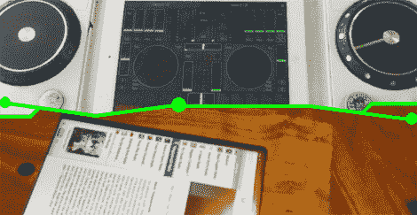

# 用 IPad 构建新界面

> 原文：<https://hackaday.com/2012/04/22/building-new-interfaces-with-an-ipad/>

有一个词——同步性——用来描述以一种有意义的方式同时发生的两件不同的事情。我们在黑客日举报热线中经常看到这种情况；两个人几乎同时以相似的方式发出了解决相似问题的相似的黑客攻击。这是[Bryce]和[spektakx]的两个版本，它们在几分钟内就到达了我们的收件箱，都实现了与 iPads 的现有接口。

#### iPad 转盘控制器

[spektakx]送来了一个由 iPad 驱动的 DJ MIDI 控制器,他以此为原型来测试即将到来的制作的大小、方向和布局。转盘控制器是简单的 [USB 事务](http://www.djtechprousa.com/product_detail.asp?display=image&cate_id=63&subcate_id=135&product_id=538)制作的数字点动和刮擦记录。虽然[spektakx]承认有点未完成，但它仍然只是一个原型。此外，他还可以用 Windows 7 平板笔记本电脑购买“更合适”的硬件。休息之后，请观看[spektakx]'视频演示。

#### iPad 收银机

[Hacktheory]发现了[Bryce]的 Flickr photolog 中的一个 DIY“方形”收银机。这个建筑的电子部分实际上是不存在的；它只是一个带有信用卡读卡器的 iPad，可以插入耳机插孔。是的，我们上周刚刚看到这些“方形”信用卡读卡器。这个建筑的制作部分令人难以置信——[ Bryce]在那里有几块很棒的胡桃木，在木材方面做得非常出色。它可能不太适合大批量零售，但我们想不出比这更适合精品店的收银机了。

[https://www.youtube.com/embed/hebNi_NlSdo?version=3&rel=1&showsearch=0&showinfo=1&iv_load_policy=1&fs=1&hl=en-US&autohide=2&wmode=transparent](https://www.youtube.com/embed/hebNi_NlSdo?version=3&rel=1&showsearch=0&showinfo=1&iv_load_policy=1&fs=1&hl=en-US&autohide=2&wmode=transparent)