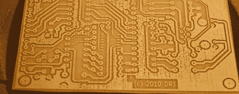

# 在废弃的 Epson 打印机上打印 PCB

> 原文：<https://hackaday.com/2012/04/24/printing-pcbs-on-a-junked-epson-printer/>

当谈到在家里快速制作 PCB 时，与[Ryan]的[bodded Epson 打印机](http://www.instructables.com/id/Converting-an-Inkjet-Printer-to-Print-PCBs/)相比，没有太多改进，它直接在一块覆铜板上打印蚀刻掩模。

像我们讨论过的大多数直接到铜 PCB 打印机的转换一样( [1](http://hackaday.com/2011/10/17/modding-an-inkjet-for-pcb-production/) 、 [2](http://hackaday.com/2011/03/18/direct-to-pcb-resist-printing-requires-minimal-additional-components/) 、 [3](http://hackaday.com/2011/02/28/direct-to-pcb-etch-resist-printing/) )，【Ryan】的构建依赖于爱普生打印机和 [Mis Pro 黄色墨水](http://www.inksupply.com/product-details.cfm?pn=MISPRO-4-Y)。Mis Pro 墨水是喷墨打印机中最耐蚀刻的物质之一，爱普生打印机墨盒使用压电泵，非常适合根据命令喷射墨水。

在拆开打印机并稍微抬起打印头后，[Ryan]需要一个合适的进给系统来控制他在铜片上打印的位置。他设法用一片铝片做了一个电路板支架。通过贴上覆铜板，一切似乎都工作正常。

休息过后，你可以看看[Ryan]打印出完全抗蚀刻的 PCB 有多快。他一小时能生产几十块木板，这并非不可能；我们的墨粉转移印刷电路板生产方法将杀死的东西。

via [makezine](http://blog.makezine.com/2012/04/20/converting-an-inkjet-printer-to-print-pcbs/)

[https://www.youtube.com/embed/Fpflg2KcORY?version=3&rel=1&showsearch=0&showinfo=1&iv_load_policy=1&fs=1&hl=en-US&autohide=2&wmode=transparent](https://www.youtube.com/embed/Fpflg2KcORY?version=3&rel=1&showsearch=0&showinfo=1&iv_load_policy=1&fs=1&hl=en-US&autohide=2&wmode=transparent)