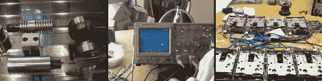

# Pong，一个引擎，还有邦德主题(天啊！)

> 原文：<https://hackaday.com/2012/04/24/pong-an-engine-and-bond-theme-oh-my/>

希望你不在屏蔽 YouTube 的网络上，因为我们正在分享展示三个不同项目的视频。唉，他们没有给出任何关于开发过程的细节，但我们认为你会喜欢看到最终的结果。

首先是斯特林发动机。这是一个非常严肃的事情，机械零件组成了酒精灯驱动的引擎。这比上个月的[金枪鱼罐头版本](http://hackaday.com/2012/03/09/tuna-can-and-some-other-trash-turned-into-a-sterling-engine/)要优雅得多。

拿出你的 Arduino，尝试一下原始的视频游戏。[这个乒乓游戏](http://www.youtube.com/watch?v=Ree38VGZ0qY)是在示波器上使用两个微型微调端口进行的。为了实现这一点，一对 MCP4901 DAC 芯片正在为探针供电。

当你拿出那个友好的蓝色分线板时，不妨拿一套旧的 foppy 驱动器。这里是詹姆斯·邦德主题的八声道版本。与前几周的采样器[不同，这款采样器利用步进电机的噪音来创造甜美的音乐。](http://hackaday.com/2012/04/12/floppy-drive-as-an-audio-sampler/)