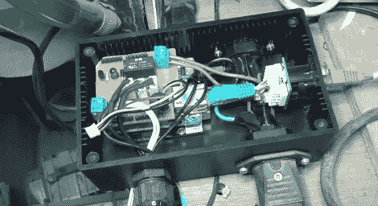

# CoolBot 可以防止激光切割机过热

> 原文：<https://hackaday.com/2012/04/24/coolbot-keeps-your-laser-cutter-from-overheating/>

[查尔斯]来信分享他刚刚为伦敦黑客空间建立的项目。他称之为 CoolBot，顾名思义[它负责防止激光切割机过热](http://www.electriclaboratory.com/2012/04/24/coolbot-hackspace-project/)。

这个系统的核心是一个水泵。它使用一个塑料储存容器作为储器，从盖子顶部的激光管输出。[Charles]使用 3D 打印部件安装了一个温度传感器，将其固定在回流的中心。Arduino 克隆使用该传感器以及环境室温和激光管温度传感器来决定何时打开冷却泵。与任何 hackerspace 插件一样，如果没有互联网连接，这将是不完整的，所以他在项目箱中包含了一个以太网屏蔽。说起来，那个盒子使用面板安装连接器来保持灰尘和水远离电子设备。但是控制器盒的盖子还包括一个字符 LCD，用于快速参考。

不要错过休息后视频中[Charles']对系统的解释。

[https://www.youtube.com/embed/MwUcRc7Mizo?version=3&rel=1&showsearch=0&showinfo=1&iv_load_policy=1&fs=1&hl=en-US&autohide=2&wmode=transparent](https://www.youtube.com/embed/MwUcRc7Mizo?version=3&rel=1&showsearch=0&showinfo=1&iv_load_policy=1&fs=1&hl=en-US&autohide=2&wmode=transparent)