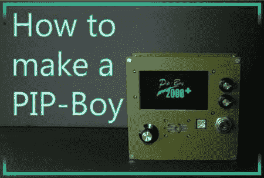

# PiP-Boy 2000 的设计注重功能而非形式

> 原文：<https://hackaday.com/2012/04/24/pip-boy-2000-build-goes-for-function-over-form/>

[丹尼尔]写信告诉我们他的 [PIP-Boy 2000 原型](http://www.instructables.com/id/How-to-Make-a-PIP-Boy/)。虽然我们看到的大多数[皮普男孩翻拍倾向于更注重美学方面](http://hackaday.com/2011/09/06/fallout-brought-to-life-with-this-working-pip-boy-3000/)，就像一个道具一样，[丹尼尔]试图制作一个功能性的。他在他的建筑中包括了 GPS 传感器、RFID 阅读器和辐射探测器，但选择坚持菜单中熟悉的 PIP-Boy 视觉主题。如果他想让它做《辐射》中的小男孩所做的一切，他还有很长的路要走，但他的半功能特性列表正在稳步增长。

目前有以下基本功能:

*   自动地图和航路点导航
*   外部 PC 接口
*   库存状态和项目识别(使用 RFID)
*   玩家体验(当你去新地点时增加体验)
*   环境辐射
*   屏幕保护程序

让我们知道你什么时候让那个混蛋停止时间[丹尼尔]