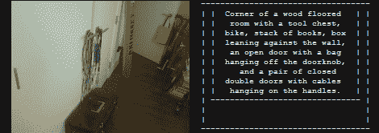

# 为你描绘画面的相机

> 原文：<https://hackaday.com/2012/04/25/a-camera-that-describes-a-picture-for-you/>

[Matt]的[描述型相机](http://mattrichardson.com/Descriptive-Camera/)看起来就像任何其他的傻瓜相机，尽管看起来更像盒子和自制的。它的工作原理甚至就像过去的宝丽来相机一样——拍一张照片，几分钟后你就可以拿到复制品了。与以前的任何相机不同，[马特]的相机不会给你一个图像。[Matt]的相机给你一张你拍的照片的*描述*，打印在容易剪贴的热敏纸上。是的，人类现在是*那个* meta。

为了构建他的相机的硬件，[Matt]拿了一台 [BeagleBone](http://beagleboard.org/bone) 单板 Linux 计算机，连接了一个网络摄像头和一台热敏收据打印机。真正的魔力在于人工智能，即[机械土耳其人](https://www.mturk.com/mturk/welcome)。[Matt]的相机将他的照片上传到网上，某个陌生人描述了他的照片。该描述被发回并打印在收据纸上。

即使[马特]花费 1.25 美元在机械土耳其人上描述一张照片，可能也没有另一台相机像它一样复古-超赞-神奇。