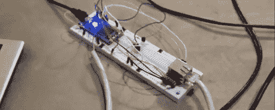

# 使用谷歌日历自动化家用设备

> 原文：<https://hackaday.com/2012/04/25/automating-household-devices-with-google-calendar/>

[Shane]正在建造一栋新房子，想要一些他称之为“精细家庭自动化”的东西。他的第一个项目是将一个小加热器接入互联网，从 T2 的演示视频来看，一切进展顺利。

[Shane]的项目是围绕一个通过以太网连接到互联网的 [mbed](http://mbed.org/handbook/mbed-Microcontrollers) 微控制器构建的。mbed 有一个温度控制器和一个固态继电器，用于打开和关闭加热器；很简单，但我们真的很喜欢[Shane]将他的项目与谷歌日历连接起来的便捷性。

在查看了谷歌 API 之后，可以理解的是，谢恩感到不知所措。他发现，通过将 mbed 的时钟与网络时间同步，并在未来的一分钟内发送 GET 请求，mbed 将总是以最小的延迟知道安排了什么。

现在，谢恩所做的就是打开他的加热器，在谷歌日历中安排时间和温度。他可以在全球或全国范围内做到这一点，并成为家庭自动化系统中非常灵活的一部分。

[https://www.youtube.com/embed/NlhNqCOUpZ4?version=3&rel=1&showsearch=0&showinfo=1&iv_load_policy=1&fs=1&hl=en-US&autohide=2&wmode=transparent](https://www.youtube.com/embed/NlhNqCOUpZ4?version=3&rel=1&showsearch=0&showinfo=1&iv_load_policy=1&fs=1&hl=en-US&autohide=2&wmode=transparent)