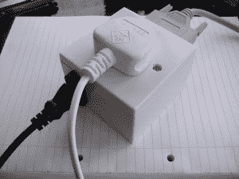

# 通过蓝牙控制电源

> 原文：<https://hackaday.com/2012/04/25/controlling-the-power-with-bluetooth/>

[Mike]给了我们一个提示，向我们展示他建立的一个系统，这个系统根据他的接近程度来控制一些电源插座。最初，该项目是从一个[并行端口控制箱开始的，用于切换主电源](http://www.mike-worth.com/2012/02/24/controlling-the-mains-via-the-parallel-port/)。然后他有了一个想法，把它变成一个更具互动性的自动化工具。他利用手机上的蓝牙作为定位器。当盒子感应到他在房间里时，电源就打开了。当他离开这个地区时，电源就关闭了。如果你想试试或者提供改进，你可以在他的网站上看到他的 ruby 代码。