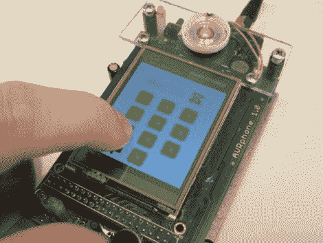

# AVRphone 是一款准系统触摸屏手机

> 原文：<https://hackaday.com/2012/04/26/avrphone-is-a-barebones-touchscreen-cellphone/>

这个小设备是基于 ATmega128 微控制器的原型手机。它拥有一个 2.4 英寸的触摸屏作为键盘，并使用 SIM100S 模块负责 GSM 无线电通信。但是硬件并不是唯一吸引人的部分。从屏幕截图来看，构建用户界面也花费了相当多的时间。

最近我们似乎有大量的手机产品。这个非常干净，比这个准系统示例占用空间更小，屏幕更大。如果你有兴趣比综述文章更深入地挖掘，可以使用白皮书。但是它是用捷克语写的，除了从[的 PDF 文件](http://dir.adamh.cz/soc2011/soc2011.pdf)中复制文本并粘贴到一个翻译器中，我们没有看到提供机器翻译的方法。