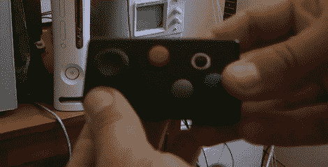

# 微小的 N64 控制器附带手抽筋保证

> 原文：<https://hackaday.com/2012/04/27/tiny-n64-controller-comes-with-hand-cramp-guarantee/>

光看这个小东西就让我们手疼。但是[Kirren]确实做了一件伟大的工作，在一个小小的项目盒子中构建了一个 N64 控制器。这不是一个 mod，而是一个基于 PIC 16F628 微控制器的全新构建。

它拥有标准控制器上的大多数按钮，他向我们保证，你可以玩大多数游戏，而不会错过那些没有纳入设计的游戏。你只能辨认出左边的模拟棒，但右边的银环实际上是一个四向触觉开关，代表 C 按钮。他也包括 Start，A，B，R，z。

上面的链接指向他的维基，如果你有兴趣自己做这件事或者只是想了解一切是如何工作的，这里有足够多的细节。查看他关于该协议的文章，你甚至可以得到他的代码的副本。休息之后还有一个视频演示，展示了[Kirren]与控制器之间的一些联系。

[https://www.youtube.com/embed/YT_C8aPI8m8?version=3&rel=1&showsearch=0&showinfo=1&iv_load_policy=1&fs=1&hl=en-US&autohide=2&wmode=transparent](https://www.youtube.com/embed/YT_C8aPI8m8?version=3&rel=1&showsearch=0&showinfo=1&iv_load_policy=1&fs=1&hl=en-US&autohide=2&wmode=transparent)