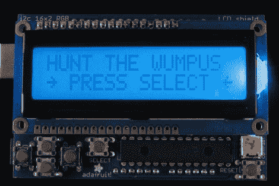

# Arduino 的文字冒险，从猎杀 Wumpus 开始

> 原文：<https://hackaday.com/2012/04/27/text-adventures-for-arduino-starting-with-hunt-the-wumpus/>

老实说，现在你很难让孩子们玩基于文本的冒险游戏。但这是让他们感兴趣的一种方式。这个周末，你应该和侄女、侄子、儿子或女儿聚在一起，帮助他们[建造自己的硬件，并用冒险游戏](http://www.adafruit.com/blog/2012/04/27/how-to-arduino-retro-gaming-hunt-the-wumpus/)为其编程。在学校放假和天气变好之前的最后一个项目。

这是[丹]猎杀温普斯的光辉例子。他为 Arduino 使用了 Adafruit 的 RGB LCD 屏蔽。它有一个字符液晶显示器和五个按钮。但是你可以很容易地使用一些技巧加上一个屏幕和你自己选择的 uC 来试验这个。这个的一个很好的接触是 RGB 背光，用来给故事线增加危险的元素。他还提到了几个 Arduino 语言中的 bug，这些 bug 是他在设置游戏时发现的。

自从我们读了“Ready Player One”之后，我们就一直想用 Arduino、GLCD 和 PS/2 键盘制作我们的 Zork 版本。这只是一点点鼓励，让我们继续这个项目。

[感谢 PT]