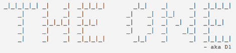

# 接收异步数据突发

> 原文：<https://hackaday.com/2012/04/27/receiving-asynchronous-data-bursts/>

(Johan 的)在一大块代码上工作了大约七年，他认为它可以帮助你的下一个项目。他称之为 D1 (The One)，它让你[接收异步数据，而不需要硬件 USART](http://vonkonow.com/wordpress/2012/04/d1/) 。它能够处理来自红外或射频遥控器的信号，以及像 RFID 和磁条阅读器这样的相关传输。

它使用定时器和端口中断对输入数据进行采样。一旦它捕获到一个传输，代码就会设置一个标志，这样您就可以将它捕获到的内容放入您自己的应用程序中。如果您希望收到一个连续多次发送数据包的协议，还包括一个验证模块，它作为设置 received 标志的前提条件运行。这个包是用 PIC 汇编写的，但是根据[Johan]在他的文章中包含的所有信息，移植到其他芯片架构应该不难。