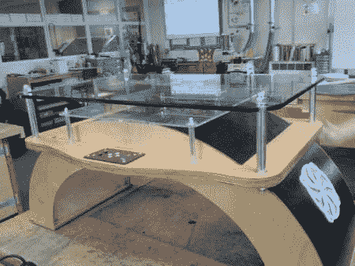

# 交互式表格与大多数表格略有不同。

> 原文：<https://hackaday.com/2012/04/29/interactive-table-is-slightly-different-than-most/>

[DanNixon]已经将这个独特的[交互式桌子概念](http://www.instructables.com/id/Interactive-Arduino-Powered-Coffee-Table/)组合在一起。通常，当我们看到交互式桌子这个术语时，我们会想到 LED 网格。这恰好是我们最常看到的。虽然这张桌子确实在桌面上有一个 LED 网格，但它还有其他几个功能和一些非常好的结构。

[DanNixon]决定建造一个视觉上更吸引人的建筑，而不是走通常的无聊的矩形路线。仅这一部分的构建日志就值得一看。之后，他有一个小的液晶显示屏，用于显示标题和歌曲名称，还有一个紧凑的 LED 矩阵，用于一些可视化。

干得好[DanNixon]

[【http://youtu . be/hda-T6 bdcg 0】](http://youtu.be/hdA-T6bdcg0)