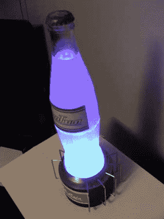

# 努卡可乐道具看起来有放射性

> 原文：<https://hackaday.com/2012/04/28/nuka-cola-prop-looks-deliciously-radioactive/>

这是 Hackaday 上的又一篇负面报道。这一次，有人为标志性的努卡可乐建造了一个奇妙的道具，而不是这个小男孩。电路超级简单，实际上只是一个 LED 阵列来点亮饮料。不过，基地的建筑相当不错。如果你是功能性道具的粉丝，或者至少是半功能性的(我们怀疑它尝起来很清爽)，你会喜欢这个构建的。

如果你想知道那个瓶子里的*是什么*，它基本上只是奎宁水。对于那些不知道的人来说，补品在紫外线下会发光。[Kfklown]添加了几滴颜料来获得完美的颜色。你会注意到在底座上有红色和蓝色的发光二极管，还有彩色的紫外线。