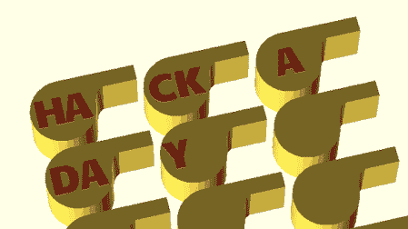

# 在 RepRap 会议上为每个人打印自定义口哨

> 原文：<https://hackaday.com/2012/04/28/printing-custom-whistles-for-everyone-at-your-reprap-conference/>

当(Josef Prusa)在一次会议上称赞 3D 打印的优点时，他喜欢分发打印出来的物品来展示家庭自制的可能性。[Prusa]最喜欢的是哨子——它们很实用，展示了 3D 打印机到底能做什么。打印数百个哨子是工厂的工作，而不是打印机，所以[Prusa]决定用一个与会者的首字母定制每个哨子。

当[Prusa]被邀请参加在布拉迪斯拉发举行的 INFOTRENDY 会议时，他只有很少的听众(只有 150 人),并且提前一周拿到了所有与会者的名单。这是一个完美的场景，用 Python 脚本来生成哨子的模型，每个参与者的首字母都印在侧面。

WhistleGen 代码已经在[Prusa]的 GitHub 上[准备好为你的下一次会议打印出定制的哨声。虽然 WhistleGen 的功能仅限于两个字母的文本，但我们相信很快就会有人想出一种方法来自动生成定制的会议徽章。](https://github.com/prusajr/WhistleGen)

请看休息后他发给我们的例子。

