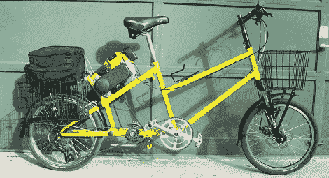

# 家酿电动自行车是一个超级杂货店吸气剂

> 原文：<https://hackaday.com/2012/04/28/home-brew-motorized-bicycle-is-a-super-grocery-getter/>

[托尔]送来了一个令人敬畏的[摩托车模型，他发现](http://www.outsideconnection.com/gallant/hpv/sgg/)来自于[吉姆·格兰特]富有成果的工作室。这是一件几乎完全从零开始的不可思议的作品。

[Jim]在自制夹具上将框架焊接在一起，该夹具使所有的铬钼管在拼接之前保持对齐。有了夹具，车架保持得非常直，使得自行车转向非常好，可以徒手骑行。

[吉姆]以前所有的机动自行车都使用小型本田发动机，但在听说罗宾·斯巴鲁的发动机更可靠后，他决定试一试。马达通过通常在踏板车中发现的连续可变传动装置连接到拨链器齿轮。[Jim]早期的电动自行车不像现代电动自行车那样有变速杆和盘式制动器，但他还是决定把它们扔进去。每个骑着他的新超级杂货店吸气剂的人都评论说，有了这些附加物，骑起来有多平稳。

虽然[Jim]没有官方的速度或 MPG 评级，但他猜测这辆自行车可以以 30 英里/小时的速度每加仑 170 英里的速度载三袋杂货。这是一种非常高效的交通方式，比我们以前见过的其他机动自行车安全得多。