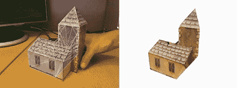

# 通过网络摄像头获得纹理 3D 扫描

> 原文：<https://hackaday.com/2012/04/30/getting-a-textured-3d-scan-from-just-a-webcam/>

这是一个老掉牙的好东西，第一次在互联网上流传时，我们就错过了。剑桥大学(前)博士生潘琪只用一个简单的网络摄像头制作了一个 3D 建模程序。这不仅使得构建 3D 模型的工作非常快速，而且真实的纹理也被渲染到虚拟物体上。

这个项目叫做形式设计，为了更好地了解它有多快，上面看到的教堂模型是在一分钟多一点的时间里捕捉和渲染的。为了获得令人难以置信的速度，齐让他的摄像头拍摄了一系列关键帧。当模型旋转大约 10°时，另一个关键帧被拍摄，并且用一些非常奇特的数学方法对角进行三角测量。

虽然[齐]的项目是 2009 年的，但它似乎比我们不久前看到的可通过 Kinect 进行 3D 扫描的重建技术要好。休息之后有一个很棒的视频，是关于[齐]制作一个纸艺教堂的，但是为了更好地了解形式上的工作，请查看的实际文件。

[https://www.youtube.com/embed/vEOmzjImsVc?version=3&rel=1&showsearch=0&showinfo=1&iv_load_policy=1&fs=1&hl=en-US&autohide=2&wmode=transparent](https://www.youtube.com/embed/vEOmzjImsVc?version=3&rel=1&showsearch=0&showinfo=1&iv_load_policy=1&fs=1&hl=en-US&autohide=2&wmode=transparent)