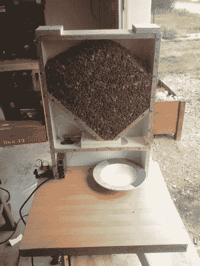

# 带视野的自动猫喂食器

> 原文：<https://hackaday.com/2012/05/01/automated-cat-feeder-with-a-view/>

[Robovergne]来信与我们分享他的[神奇的自动喂猫器](http://www.robovergne.com/en/electro/distributeur-croquettes/)。在研究了他能找到的常见商业产品后，他决定制造一种利用自制线性致动器从水库中抽取一定量的水的产品。最初，他试图使用微波马达，但最终发现它们太弱，如果卡住了，就无法推动猫粮。他担心这种额外的压力会很快导致运动障碍。最终，他用一个相当强大的伺服系统取代了微波马达，这似乎可以很好地完成工作。他目前使用 arduino 来计时，但他确实提到，他认为对于这样一个简单的任务来说，使用 Arduino 是一种浪费。

正如你在休息后的视频中所看到的，他的机制似乎相当稳固。运动中没有太多的游戏，出来的食物量似乎是相当可控的。

[https://www.youtube.com/embed/f1_iLfK5qr8?version=3&rel=1&showsearch=0&showinfo=1&iv_load_policy=1&fs=1&hl=en-US&autohide=2&wmode=transparent](https://www.youtube.com/embed/f1_iLfK5qr8?version=3&rel=1&showsearch=0&showinfo=1&iv_load_policy=1&fs=1&hl=en-US&autohide=2&wmode=transparent)

[https://www.youtube.com/embed/_35feY7N8wc?version=3&rel=1&showsearch=0&showinfo=1&iv_load_policy=1&fs=1&hl=en-US&autohide=2&wmode=transparent](https://www.youtube.com/embed/_35feY7N8wc?version=3&rel=1&showsearch=0&showinfo=1&iv_load_policy=1&fs=1&hl=en-US&autohide=2&wmode=transparent)