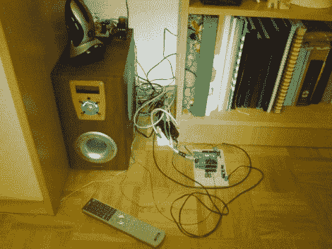

# 环绕声系统控制器更换包括家庭自动化

> 原文：<https://hackaday.com/2012/05/02/surround-sound-system-controller-replacement-includes-home-automation/>

[Neoxy]一直想为他的电脑配备环绕声，有一天，他设法得到了一个死气沉沉的 5.1 系统。能修别人的垃圾为什么还要买一个呢，对吧？事实证明，说起来容易做起来难，但在几次失败后，他通过更换微控制器成功恢复了音频系统。

我们发现他解决问题的技巧很有趣。放大器会顺利通电，但不会发出任何声音。所以他拿了一根耳机线，用 L 和 R 导线做探针。该电缆由 MP3 播放器供电，通过将探针接触前置放大器和放大器电路的音频输入，他可以从扬声器中获得很好的声音。合理地确定这些板工作正常后，他将问题缩小到混合、选择输入和控制系统的三个芯片。

用 ATmega328 和 Arduino 做了大量的原型设计，让他实现了你在休息后的视频中看到的功能。他不仅让系统正常工作，还使用 Arduino 为设备添加互联网控制。

[https://www.youtube.com/embed/tExITUtYqXA?version=3&rel=1&showsearch=0&showinfo=1&iv_load_policy=1&fs=1&hl=en-US&autohide=2&wmode=transparent](https://www.youtube.com/embed/tExITUtYqXA?version=3&rel=1&showsearch=0&showinfo=1&iv_load_policy=1&fs=1&hl=en-US&autohide=2&wmode=transparent)