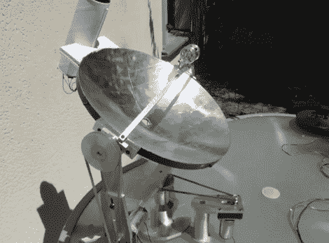

# 自动跟踪的太阳能斯特林发动机

> 原文：<https://hackaday.com/2012/05/02/sun-powered-stirling-engine-with-automatic-tracking/>

看看这个太阳能斯特林发动机 ( [翻译](http://translate.google.com/translate?sl=auto&tl=en&js=n&prev=_t&hl=en&ie=UTF-8&layout=2&eotf=1&u=http%3A%2F%2Fforum.snootlab.com%2Fviewtopic.php%3Fp%3D2037%23p2037))。这个建筑是一个高中班级的一部分，他们包含了一些非常好的功能。第一个是抛物面镜，它把太阳光聚焦在发动机的燃烧室上。热量是它前进的动力，休息后的视频显示它就是这样做的。

但是镜子背后的概念带来了一个有趣的挑战。光能聚焦在一个狭窄的点上。当太阳在天空中移动时，该点将不再处于为发动机提供动力的有效位置。这个问题是通过一对可以重新定位盘子的步进电机来解决的。这是由 Arduino Uno 自动完成的，它从安装在盘子顶部的纸板管中的四个 LDR(光敏电阻)读取读数。如果四者的光强度相同，那么灯管就指向太阳。如果没有，马达会被调整到最佳角度。

[https://www.youtube.com/embed/azKWh3mYVsQ?version=3&rel=1&showsearch=0&showinfo=1&iv_load_policy=1&fs=1&hl=en-US&autohide=2&wmode=transparent](https://www.youtube.com/embed/azKWh3mYVsQ?version=3&rel=1&showsearch=0&showinfo=1&iv_load_policy=1&fs=1&hl=en-US&autohide=2&wmode=transparent)

[谢谢莱昂内尔]