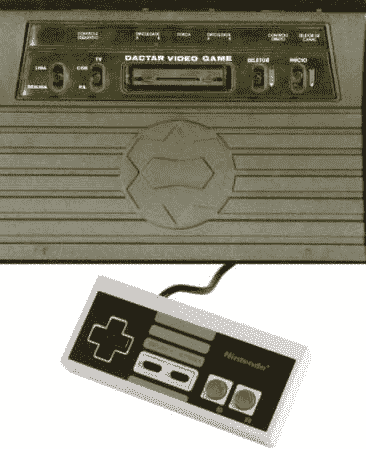

# 在 Atari 2600 上使用 NES 控制器

> 原文：<https://hackaday.com/2012/05/02/using-an-nes-controller-with-an-atari-2600/>

Instructibles 用户[Danjovic]设法弄到了一台 Atari 2600，但所有操纵杆都损坏得无法修复。他没有从零开始开发雅达利游戏手柄，而是着眼于新一代游戏，并决定用 NES 控制器代替 T1。在 Arduino 的帮助下，这很容易做到。

这似乎是一个不错的简单模式，可以为一些旧游戏注入一点新的活力，但我们无法想象没有原来的操纵杆玩游戏！