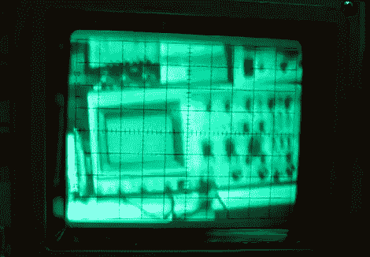

# 通过示波器屏幕观看商店参观

> 原文：<https://hackaday.com/2012/05/03/watch-a-shop-tour-through-the-screen-of-an-oscilloscope/>

[Alan]发布了他的电子商店的视频参观，但您将通过示波器的绿色屏幕观看。上面的图像是一个摄像机拍摄的一个屏幕上显示的图像…示波器(在此插入您自己的 Yo Dawg meme)。但首先他分享了他用来在示波器屏幕上显示复合视频的技术。

广告之后的前三分钟是视频展示时间。他首先看了一下试验板电路，该电路接收复合视频信号，并向示波器提供必要的 X、Y 和 Z 输入信号，以实现上述功能。然后，他浏览了基于 LM1881 视频同步分离器芯片的原理图的每一部分。水平和垂直同步信号由该芯片分离，然后经过滤波产生斜坡电压，分别驱动 X 和 y 轴。Z 轴通过一个简单的反相器电路馈电；鲍勃是你的叔叔，你的示波器现在是电视监视器。

当然，这不是第一次[这样做](http://hackaday.com/2011/03/30/oscilloscope-thinks-its-a-video-monitor/)。但我们喜欢[艾伦的]展示，认为商店参观是结束视频的一种有趣方式。

[https://www.youtube.com/embed/5FYF5uhCzAM?version=3&rel=1&showsearch=0&showinfo=1&iv_load_policy=1&fs=1&hl=en-US&autohide=2&wmode=transparent](https://www.youtube.com/embed/5FYF5uhCzAM?version=3&rel=1&showsearch=0&showinfo=1&iv_load_policy=1&fs=1&hl=en-US&autohide=2&wmode=transparent)